# Employee Management (employee.management)
## 🔗 GitHub Repository

A Spring Boot project to manage employees with CRUD operations and secure access.

## 📌 Project Overview
Employee Management System using Spring Boot, JWT Authentication, REST APIs for Employees & Departments.

## 🚀 Tech Stack

  
  
  
  

## 🔑 Features
Add new employee
Update employee details
Delete employee
View all employees
Secure login with JWT
Role-based access control:
ROLE_USER ➜ can view employees
ROLE_ADMIN ➜ can add, update, delete employees

## 📂 Project Structure
src/main/java → Application source code
src/main/resources → Configuration files
pom.xml → Maven dependencies
README.md → Documentation

## 🔒 Security
JWT-based authentication
Role-based access control (Admin/User)
Passwords encrypted using Spring Security

## ⚙️ Setup Instructions

### 1. Clone Repository

bash
git clone https://github.com/Harshi2001-21/employee_management.git
cd employee_management

### 2. Configure application.properties

properties
spring.datasource.url=jdbc:mysql://localhost:3306/employeedb
spring.datasource.username=root
spring.datasource.password=yourpassword

### 3. Run the Project

bash
mvn spring-boot:run

### 4. Test APIs in Postman

Register User
↓
Login User
↓
Copy JWT Token
↓
Access Employee APIs
↓
Access Department APIs

## 📑 API Endpoints
| **Endpoint** | **Method** | **Description** | **Auth Required** |
| --- | --- | --- | --- |
| ``/api/auth/register`` | POST | Register new user | ❌ |
| ``/api/auth/login`` | POST | Login & get JWT | ❌ |
| ``/api/employees`` | GET | Get all employees | ✅ |
| ``/api/employees/{id}`` | GET | Get employee by ID | ✅ |
| ``/api/employees`` | POST | Add new employee | ✅ (Admin) |
| ``/api/employees/{id}`` | PUT | Update employee | ✅ (Admin) |
| ``/api/employees/{id}`` | DELETE | Delete employee | ✅ (Admin) |
| ``/api/departments`` | GET | Get all departments | ✅ |
| ``/api/departments`` | POST | Add department | ✅ (Admin) |

## 🛠️ Usage Examples
GET /employees       → View all employees
POST /employees      → Add new employee
PUT /employees/{id}  → Update employee
DELETE /employees/{id} → Delete employee add chesi pampu

## 🖼️ Screenshots

### Register API
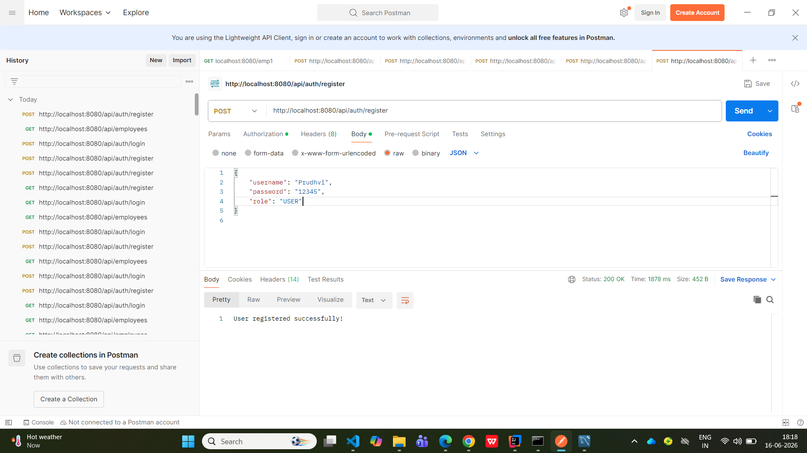

### Login API
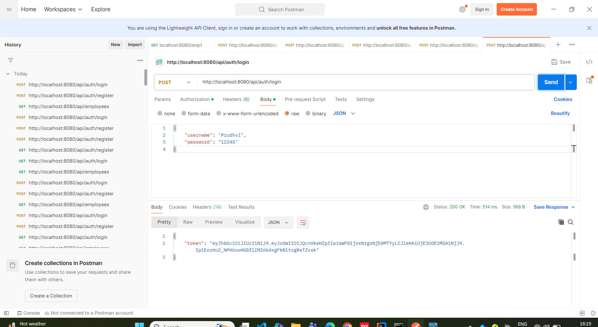

### Get Employees API
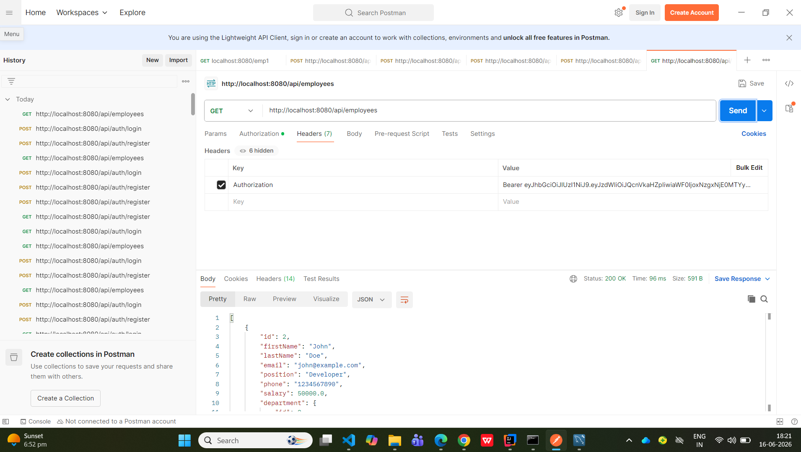

## 🔮 Future Enhancements
Role-based authorization (Admin/User)
Department management UI (React/Angular frontend)
Swagger API docs (springdoc-openapi)

## 📜 License
MIT License

## 🤝 Contributing
1. Fork the repository  
2. Create a new branch (`git checkout -b feature-branch`)  
3. Commit your changes (`git commit -m 'Add new feature'`)  
4. Push to the branch (`git push origin feature-branch`)  
5. Open a Pull Request

## API Documentation
Swagger UI → [View APIs](http://localhost:9090/swagger-ui/index.html)

## 🖼️ Swagger Screenshots  

### 👥 Employee APIs  

#### GET Employees API – Request  
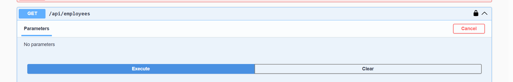

#### GET Employees API – Response  
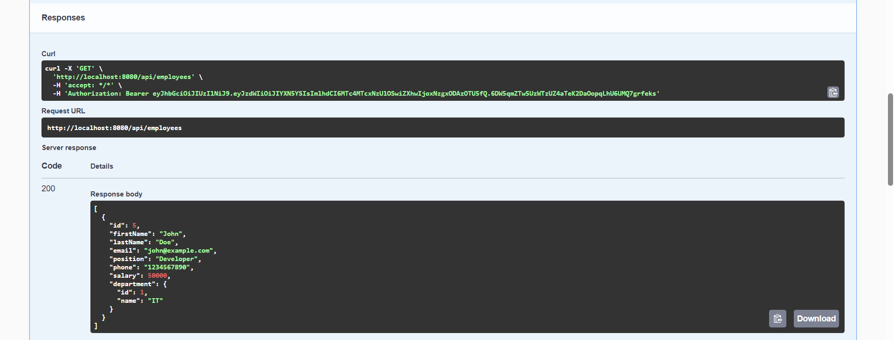

#### POST Employee API – Request  
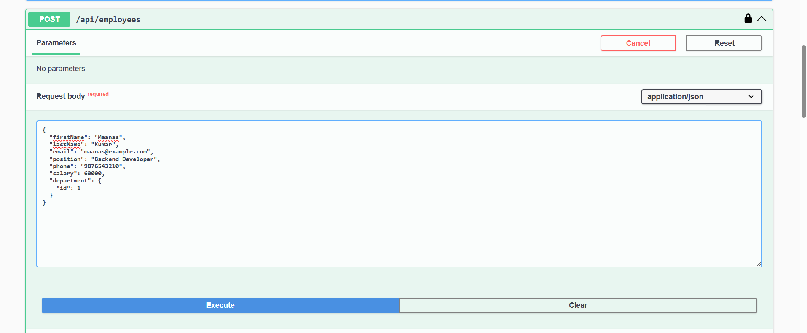

#### POST Employee API – Response  
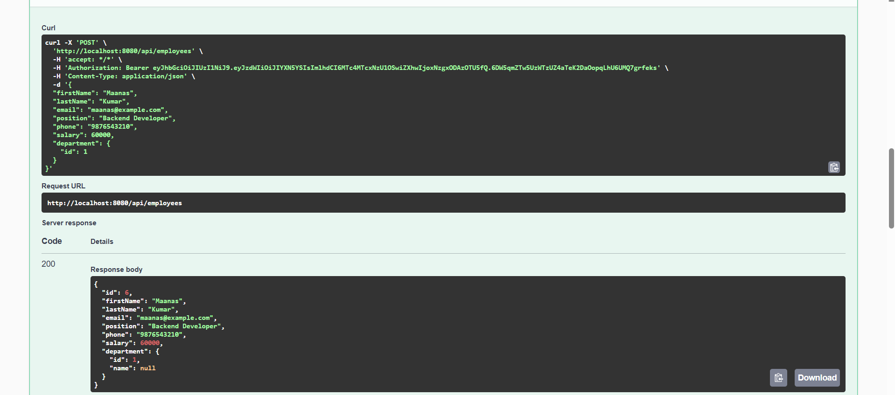

#### PUT Employee API – Request  
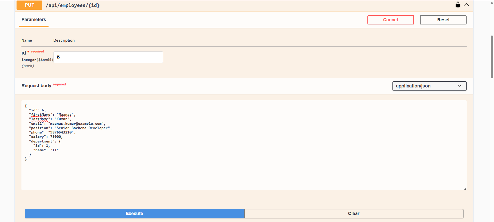

#### PUT Employee API – Response  
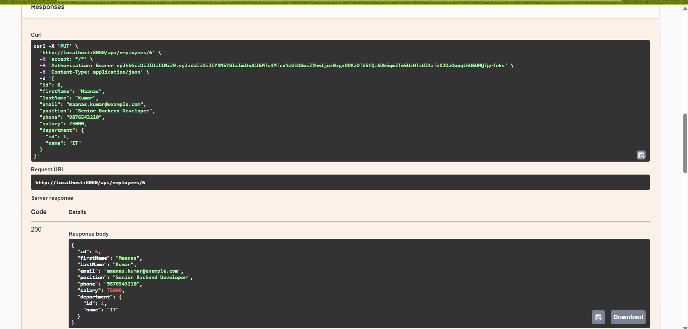

#### DELETE Employee API – Request  
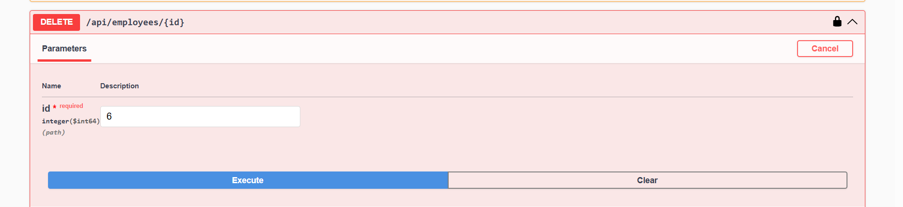

#### DELETE Employee API – Response  
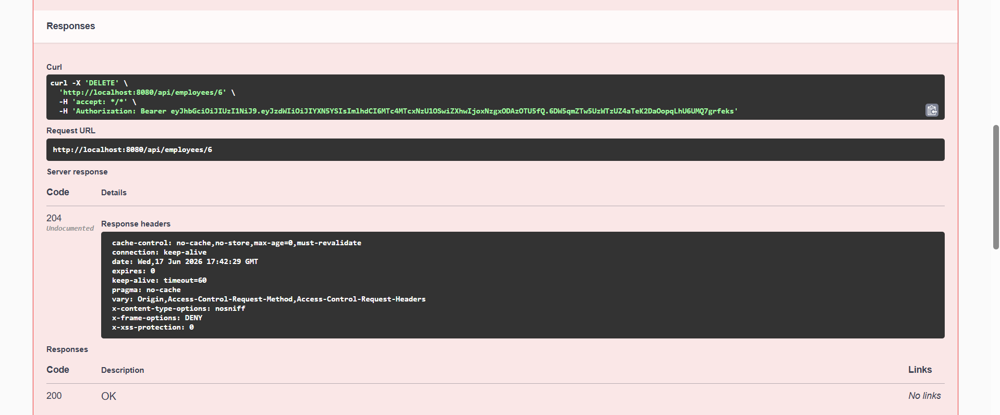

---

### 🏢 Department APIs  

#### GET Departments API – Request  
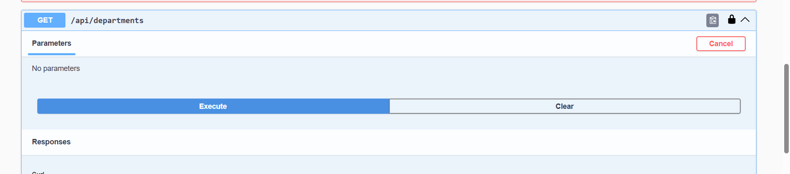

#### GET Departments API – Response  
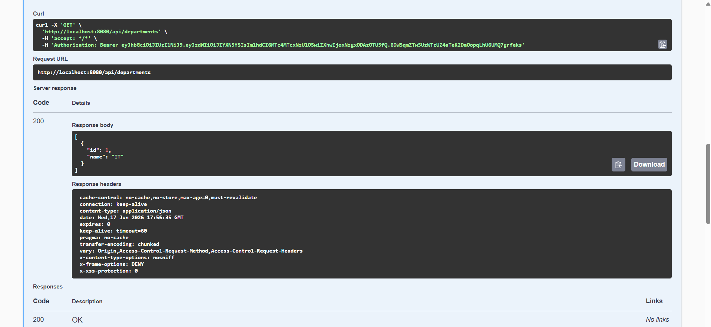

#### POST Department API – Request  
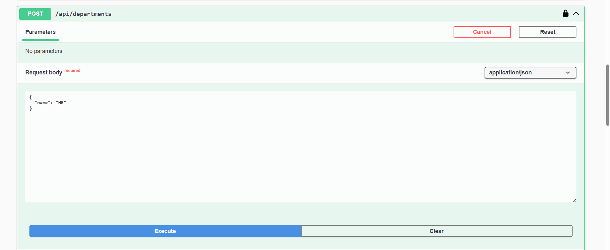

#### POST Department API – Response  
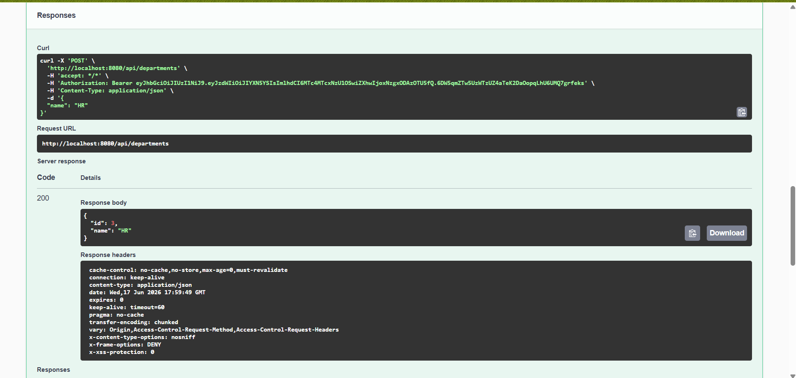

#### PUT Department API – Request  
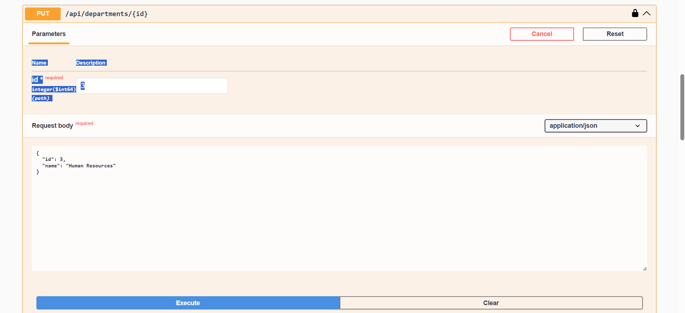

#### PUT Department API – Response  
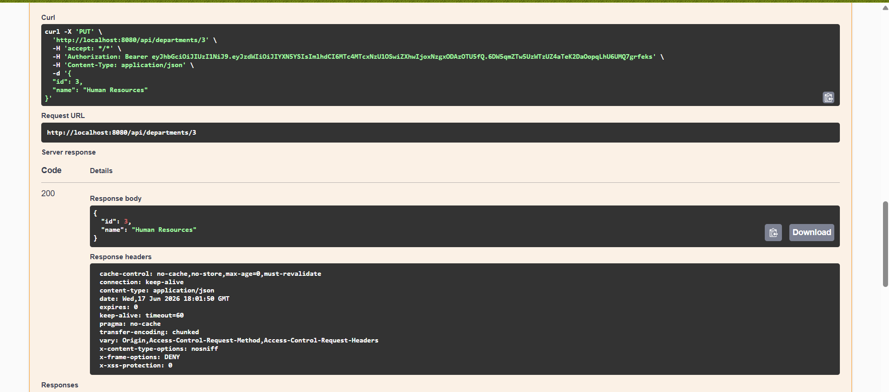

#### DELETE Department API – Request  
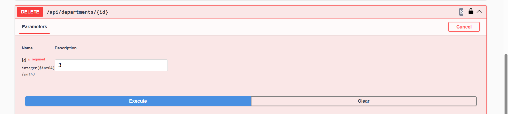

#### DELETE Department API – Response 
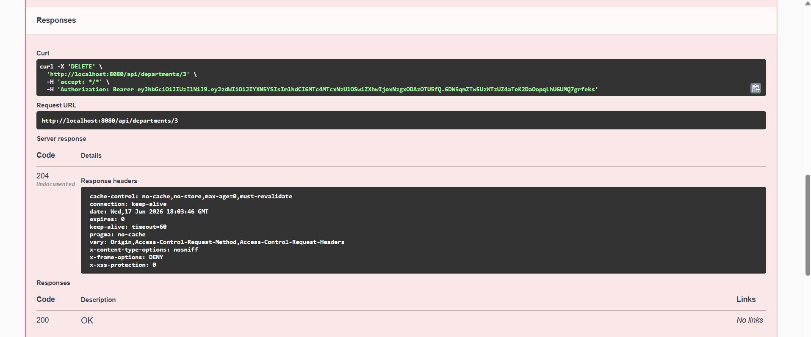

---

### 🔐 Swagger Authorize  

#### Swagger Authorize – Request  
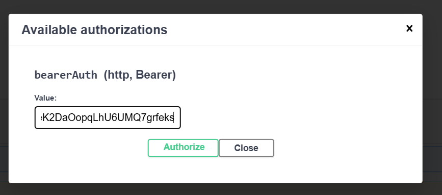

#### Swagger Authorize – Response  
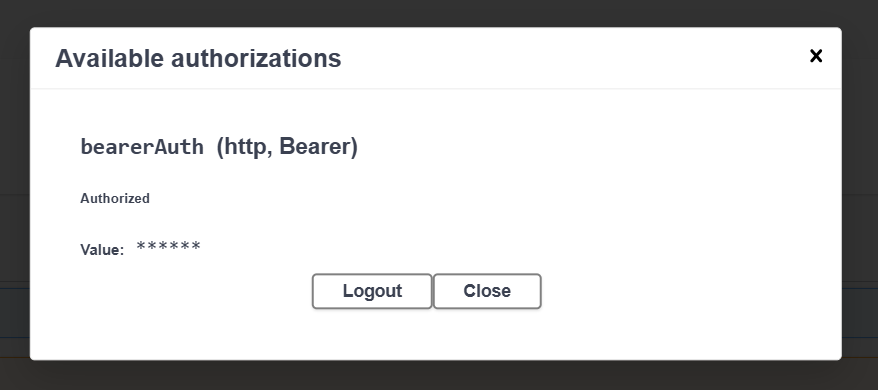

🐳 Docker Section Example
## 🐳 Docker Setup

### Build Image
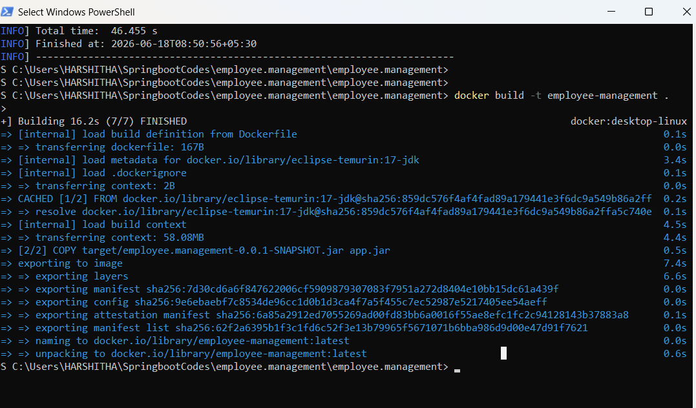

### Push to Docker Hub
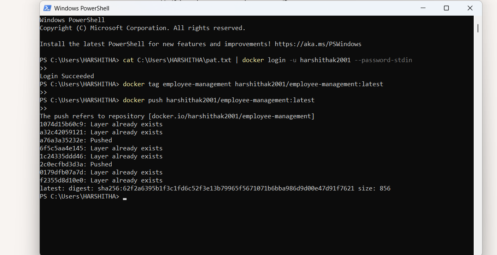

### Run Container
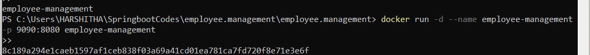

### Verify Container
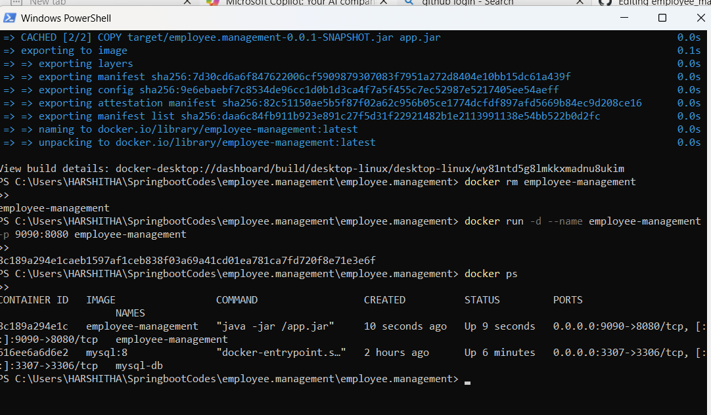

### Swagger UI
![Swagger UI].(images/swagger_ui.png)

## 📬 Contact
- Email: kannegantiharshitha21@gmail.com
- LinkedIn: [Harshitha Kanneganti](https://linkedin.com/in/kharshitha21)

